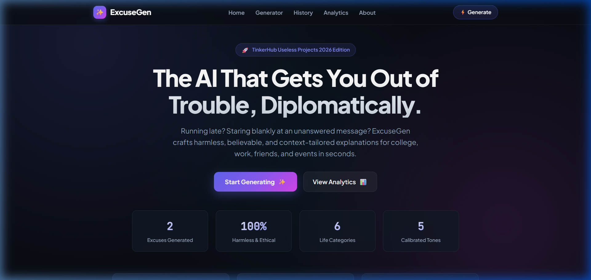
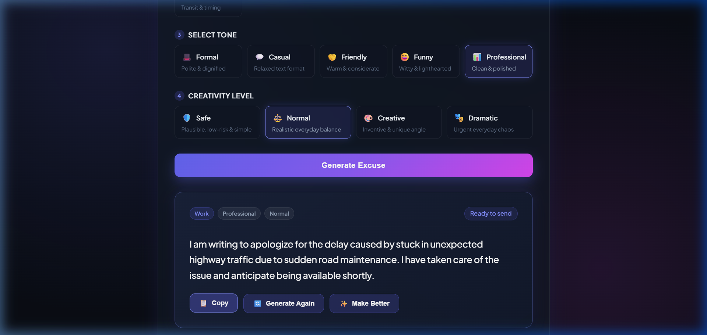
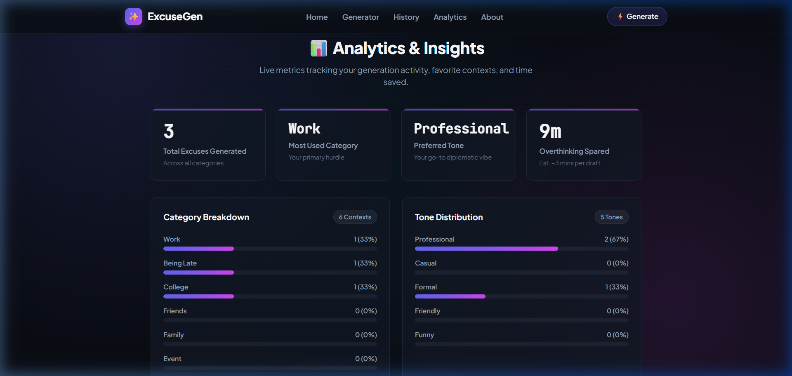
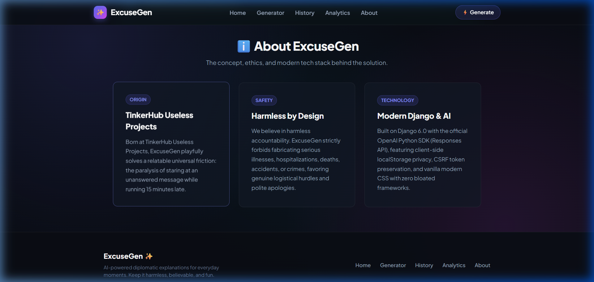
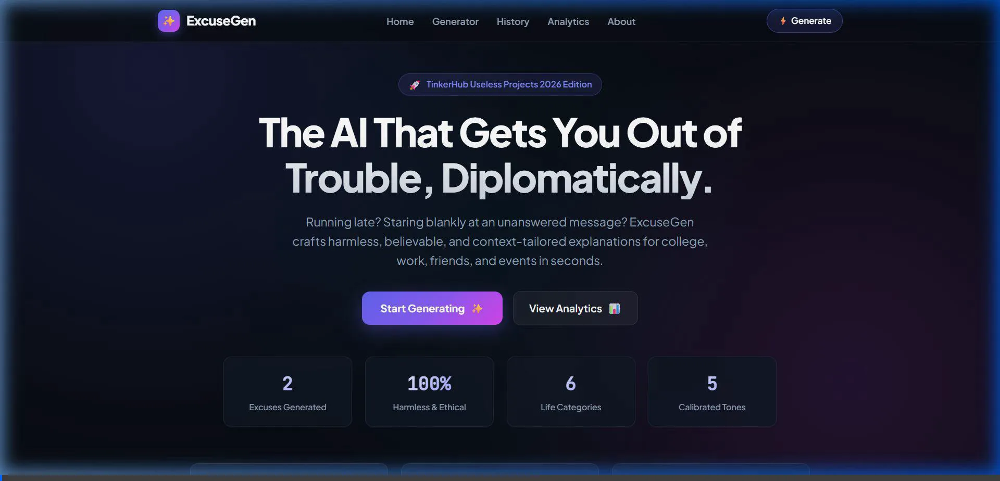

# ExcuseGen 🎭✨
*The AI That Gets You Out of Trouble, Diplomatically.*

[](https://www.tinkerhub.org/)
[](https://tinkerhub.org/events/1M8ORET9A1/useless-projects-3.0)
[](https://www.djangoproject.com/)
[](https://openai.com/)
[](https://vercel.com/)

---

## Basic Details
### Team Name: Error 404: Motivation Not Found

### Team Members
- **Team Lead:** Anha fathima shani
- **Member 2:** Vineetta ws

---

### Project Description
**ExcuseGen** is an AI-powered explanation and diplomatic excuse generator engineered to rescue procrastinators, social hermits, and late-risers from life’s most awkward confrontations. Whether you ghosted a group meeting, submitted an assignment 4 hours late, or need to dodge a Sunday family reunion, ExcuseGen crafts flawlessly tailored, believable, and harmless justifications in seconds.

---

### The Problem (that doesn't exist)
Humans spend an estimated **42.6 minutes** pacing around their rooms, overthinking text messages, and drafting 14 different drafts of an apology message just to explain why they woke up 20 minutes after their shift started. The emotional toll of crafting excuses is exhausting, inefficient, and fraught with grammatical hazards.

---

### The Solution (that nobody asked for)
Instead of relying on human anxiety, **ExcuseGen** offloads social diplomacy to generative artificial intelligence:
1. Enter your precarious situation.
2. Select your category (`College`, `Work`, `Friends`, `Family`, `Event`, `Being Late`).
3. Calibrate your conversational tone (`Formal`, `Casual`, `Friendly`, `Funny`, `Professional`).
4. Set your risk-adjusted creativity dial (`Safe`, `Normal`, `Creative`, `Dramatic`).
5. Generate an impeccably plausible excuse in under a second!
6. Don't like the vibe? Hit **🔄 Generate Again** for an alternative angle, or **✨ Make Better** to polish the prose to perfection.

---

## Key Features

- 🎯 **Context-Aware Generation**: Tailors tone and vocabulary precisely to your target recipient (boss, professor, best friend, or strict parent).
- 🔄 **Anti-Repetition "Generate Again"**: Ensures every retry explores an entirely fresh angle rather than repeating the same narrative.
- ✨ **"Make Better" Prose Polisher**: Refines and elevates existing explanations with superior conversational diplomacy.
- 📋 **1-Click Clipboard Integration**: One-click copy with smooth visual feedback for rapid pasting into Slack, WhatsApp, or email.
- 📊 **Dynamic History & Analytics**: Tracks your session excuses, overthinking time saved, top categories, and preferred tones in real-time without requiring login (persisted in local storage).
- 🛡️ **Zero-Crash Hybrid Backend**: Powered by OpenAI's Responses API with an intelligent, offline-capable fallback engine that guarantees instant results even without an API key.
- 🕊️ **Strict Ethics Guardrails**: Enforces a strict pledge prohibiting the fabrication of medical emergencies, bereavement, or dangerous situations.

---

## Technical Details

### Technologies Used

#### Software & Backend
- **Language**: Python 3.10+
- **Framework**: Django 5.0+
- **AI Integration**: OpenAI Responses API (`gpt-4o-mini` / `gpt-4o`)
- **Fallback Engine**: Deterministic semantic template & context substitution engine
- **Environment Management**: `python-dotenv`

#### Frontend & UI
- **Structure**: Semantic HTML5 with accessible ARIA tags
- **Styling**: Vanilla Modern CSS (Dark glassmorphism, responsive grid, glowing gradients, HSL palettes)
- **Typography**: Google Fonts (*Plus Jakarta Sans* & *JetBrains Mono*)
- **Client Storage**: Browser `localStorage` (`excusegen_records_v1`)

#### Deployment & Hosting
- **Serverless**: Vercel (`@vercel/python` WSGI serverless builder)
- **WSGI Server**: Gunicorn / Django WSGI

#### Hardware
- *N/A (Pure Software Application)*

---

## Architecture & Workflow

```
[ User Input ]
  ├── Situation (up to 500 chars)
  ├── Category (College, Work, Friends, Family, Event, Being Late)
  ├── Tone (Formal, Casual, Friendly, Funny, Professional)
  └── Creativity (Safe, Normal, Creative, Dramatic)
         │
         ▼
[ Django Backend: generator/views.py ]
  ├── CSRF & Input Validation Guard
  └── Dispatches to services.py
         │
         ▼
[ generator/services.py ]
  ├── If OPENAI_API_KEY present: OpenAI Responses API
  └── If missing/offline: Smart Fallback AI Engine
         │
         ▼
[ Client-Side Interface ]
  ├── Instant Excuse Display
  ├── 1-Click Copy 📋
  ├── Generate Again 🔄
  ├── Make Better ✨
  ├── Auto-Append to History 📜
  └── Real-time Analytics Recomputation 📊
```

---

## Implementation & Setup

### Prerequisites
- Python 3.10 or higher
- `pip` (Python package manager)
- *(Optional)* OpenAI API key

### Installation

1. **Clone the repository:**
   ```bash
   git clone https://github.com/anhashani/useless_project_temp.git
   cd useless_project_temp
   ```

2. **Create and activate a virtual environment:**
   ```bash
   # Windows
   python -m venv venv
   .\venv\Scripts\activate

   # macOS / Linux
   python3 -m venv venv
   source venv/bin/activate
   ```

3. **Install dependencies:**
   ```bash
   pip install -r requirements.txt
   ```

4. **Configure environment variables:**
   Copy the `.env.example` file to `.env`:
   ```bash
   cp .env.example .env
   ```
   *(Optional)* Add your OpenAI API key in `.env`:
   ```ini
   OPENAI_API_KEY=your_openai_api_key_here
   OPENAI_MODEL=gpt-4o-mini
   DJANGO_DEBUG=True
   ```
   > **Note**: If no API key is provided, ExcuseGen seamlessly activates its built-in smart engine so you can test all features offline out-of-the-box!

5. **Run database migrations & start the development server:**
   ```bash
   python manage.py runserver
   ```
   Visit `http://127.0.0.1:8000/` in your browser.

---

## Running Automated Tests

Run the test suite covering validation, generation logic, CSRF protection, and fallback execution:

```bash
python manage.py test generator
```

Expected output:
```text
Ran 15 tests in 1.4s
OK
System check identified no issues (0 silenced).
```

---

## Project Documentation & Screenshots

### 1. Front Page & Hero Section
*Showcasing dynamic counters, instant call-to-action buttons, and value propositions.*



### 2. Core Excuse Generator & Action Bar
*Featuring prompt input, quick suggestion pills, category & tone selectors, and immediate generation with Copy, Regenerate, and Make Better controls.*



### 3. Generation History & Analytics Dashboard
*Demonstrating client-persisted historical excuses, individual deletion, and live distribution progress bars tracking categories and tone frequency.*



### 4. About & Ethics Section
*Detailing the project origin, TinkerHub Useless Projects initiative, safety pledge, and technology stack.*



---

## Project Demo Video & Walkthrough

### Interactive Walkthrough Animation



*Full recorded end-to-end user experience demonstrating smooth-scrolling navigation, instant excuse generation, clipboard copy feedback, dynamic history persistence, and live dashboard analytics recalculation.*

---

## Deployment (Vercel)

The repository includes a ready-to-deploy `vercel.json` configuration:

1. Import the repository on [vercel.com/new](https://vercel.com/new).
2. Add `OPENAI_API_KEY` (optional) in Environment Variables.
3. Click **Deploy**.

---

## Team Contributions
- **Anha fathima shani**: Full-stack architecture, Django backend setup, OpenAI Responses API integration, smart fallback generation engine, dynamic multi-section UI implementation, testing, and deployment pipeline.
- **Vineetta ws**: Project ideation, UX flow & design system, excuse prompt calibration & category testing, documentation, and quality assurance.

---

Made with ❤️ at **TinkerHub Useless Projects 3.0**


